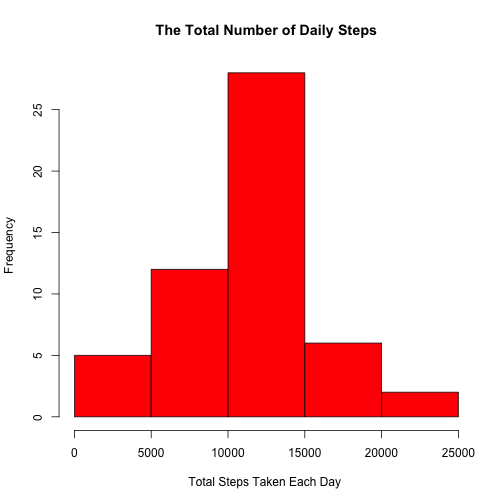
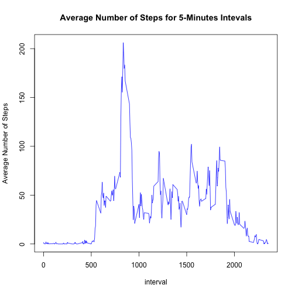
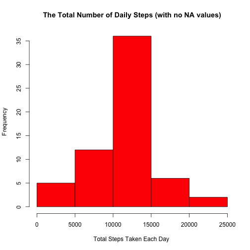
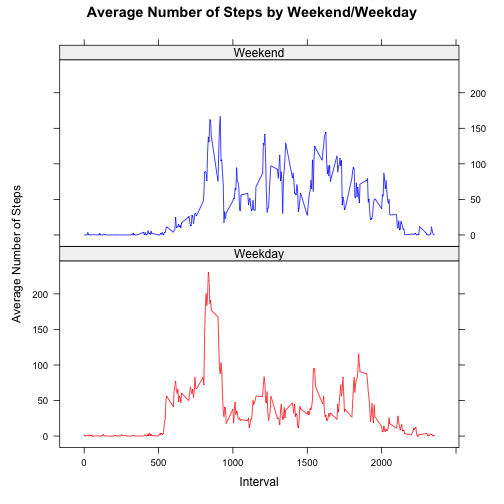

## 1. Setting the R Markdown Global Options 

Setting the global options for this R markdown document to ensure the code chunks appear to the reader.


``` r
knitr::opts_chunk$set(echo = TRUE)
```


## 2. Loading required R libraries

Two R libraries are required to run the R chunks embedded in this document: the "data.table" to load the dataset file, process it, and write new dataset files.


``` r
library(data.table)
```

```
## data.table 1.17.0 using 5 threads (see ?getDTthreads).  Latest news: r-datatable.com
```

``` r
library(lattice)
```


## 3. Loading and preprocessing the data

First, the code looks in the working directory for the "activity.csv" dataset file. If it is not there, the code will download the dataset zip file and unzip it. Second, the code reads the "activity.csv" into a data.table named: activityDT.


``` r
## Downloading the Activity Monitoring Data Set
if(!file.exists("activity.csv")){
    fileUrl <- "https://d396qusza40orc.cloudfront.net/repdata/data/activity.zip"
    download.file(fileUrl, destfile = "activity.zip", method = "curl")
    unzip(zipfile = "activity.zip") 
}
## Reading the data file
activityDT <- fread("activity.csv")

## checking the activityDT data table structure and few of its rows
str(activityDT)
```

```
## Classes 'data.table' and 'data.frame':	17568 obs. of  3 variables:
##  $ steps   : int  NA NA NA NA NA NA NA NA NA NA ...
##  $ date    : IDate, format: "2012-10-01" "2012-10-01" "2012-10-01" "2012-10-01" ...
##  $ interval: int  0 5 10 15 20 25 30 35 40 45 ...
##  - attr(*, ".internal.selfref")=<externalptr>
```

``` r
head(activityDT)
```

```
##    steps       date interval
##    <int>     <IDat>    <int>
## 1:    NA 2012-10-01        0
## 2:    NA 2012-10-01        5
## 3:    NA 2012-10-01       10
## 4:    NA 2012-10-01       15
## 5:    NA 2012-10-01       20
## 6:    NA 2012-10-01       25
```


## 4.What is mean total number of steps taken per day?

- Calculating the total number of steps taken per day (for this part, the requirements ask to ignore the missing values in the dataset).


``` r
dailySteps <- activityDT[, lapply(.SD, sum, na.rm = FALSE), .SDcols = "steps", by = date] 

## checking the dailySteps data table structure and few of its rows
str(dailySteps)
```

```
## Classes 'data.table' and 'data.frame':	61 obs. of  2 variables:
##  $ date : IDate, format: "2012-10-01" "2012-10-02" "2012-10-03" "2012-10-04" ...
##  $ steps: int  NA 126 11352 12116 13294 15420 11015 NA 12811 9900 ...
##  - attr(*, ".internal.selfref")=<externalptr>
```

``` r
head(dailySteps)
```

```
##          date steps
##        <IDat> <int>
## 1: 2012-10-01    NA
## 2: 2012-10-02   126
## 3: 2012-10-03 11352
## 4: 2012-10-04 12116
## 5: 2012-10-05 13294
## 6: 2012-10-06 15420
```

- Making a histogram of the total number of steps taken each day.


``` r
hist(dailySteps$steps, col="red", xlab="Total Steps Taken Each Day ", 
     main = "The Total Number of Daily Steps")
```



- Calculate and report the mean and median of the total number of steps taken per day


``` r
## using summary() to get the mean and median of total number of steps taken per day
summary(dailySteps$steps)
```

```
##    Min. 1st Qu.  Median    Mean 3rd Qu.    Max.    NA's 
##      41    8841   10765   10766   13294   21194       8
```

``` r
## alternatively, calculating the mean and median of total number of steps taken per day 
c(meanDailySteps = mean(dailySteps$steps, na.rm=TRUE) , medianDailySteps= median(dailySteps$steps, na.rm=TRUE))
```

```
##   meanDailySteps medianDailySteps 
##         10766.19         10765.00
```

## 5. What is the average daily activity pattern?

- Calculating the average number of steps taken, averaged across all days, for each 5-minute interval


``` r
intervalSteps <- activityDT[, lapply( .SD, mean, na.rm = TRUE), .SDcols = "steps", by = interval] 

## checking the intervalSteps data table structure and few of its rows
str(intervalSteps) 
```

```
## Classes 'data.table' and 'data.frame':	288 obs. of  2 variables:
##  $ interval: int  0 5 10 15 20 25 30 35 40 45 ...
##  $ steps   : num  1.717 0.3396 0.1321 0.1509 0.0755 ...
##  - attr(*, ".internal.selfref")=<externalptr>
```

``` r
head(intervalSteps)
```

```
##    interval     steps
##       <int>     <num>
## 1:        0 1.7169811
## 2:        5 0.3396226
## 3:       10 0.1320755
## 4:       15 0.1509434
## 5:       20 0.0754717
## 6:       25 2.0943396
```

- Making a time series plot (i.e. type = "l") of the 5-minute interval (x-axis) and the average number of steps taken, averaged across all days (y-axis)


``` r
plot(intervalSteps$interval, intervalSteps$steps, type="l", col="blue", ylab="Average Number of Steps", xlab="interval", main = "Average Number of Steps for 5-Minutes Intevals") 
```



- Finding the 5-minute interval, on average across all the days in the dataset, that contains the maximum number of steps.


``` r
c(interval_with_max_steps = intervalSteps[steps == max(steps), interval])
```

```
## interval_with_max_steps 
##                     835
```


## 6. Imputing missing values

- Calculating the total number of missing values in the dataset (i.e. the total number of rows with NAs). 


``` r
## Checking how many rows with missing values in "activityDT"
c(total_num_of_rows_with_NA_values = activityDT[!complete.cases(activityDT), .N ])  
```

```
## total_num_of_rows_with_NA_values 
##                             2304
```


``` r
## Checking how many missing values in each of the columns in "activityDT" 
sapply(activityDT, function(x) sum(is.na(x)))
```

```
##    steps     date interval 
##     2304        0        0
```


``` r
## finding the percentage of rows with missing values: 
c(percentage_of_missing_values_rows = paste(round(mean(is.na(activityDT$steps))*100, digits = 2), "%"))   
```

```
## percentage_of_missing_values_rows 
##                         "13.11 %"
```

- Devising a strategy for filling in all of the missing "steps" values in the dataset. 
    - Replacing the "steps" missing values by the mean or median of total number of steps in the day, for each of the missing value rows, is not possible. Days with the missing "steps" values, happen to have all its 5-minutes intervals have missing steps count. For such days, the mean and median will be "NA" too, so it will not help to replace the steps with "NA" values with "NA" values.
    - Replacing the "steps" missing values by the mean for that 5-minute interval, from theintervalSteps table built above, is a better strategy.


``` r
## replacing all rows with steps = NA, with the mean number of steps for the 
## same interval from the "intervalSteps" table after coercing the mean to be integer
activityDT[is.na(steps), steps := intervalSteps[.SD, on=.(interval), as.integer(x.steps)]]

## Checking if there are any rows in "activityDT" still with missing steps values 
c(total_num_of_rows_with_NA_values = activityDT[!complete.cases(activityDT), .N ])  
```

```
## total_num_of_rows_with_NA_values 
##                                0
```

- Creating a new dataset that is equal to the original dataset but with the missing data filled in. Writing this new dataset to the working directory under the name:  "activityWithNoNAs.csv".


``` r
fwrite(activityDT, file = "activityWithNoNAs.csv")
```

- Calculating the total number of steps taken per day (after replacing all missing steps values in the dataset with the mean of the total steps for the same intervals).


``` r
completeDailySteps <- activityDT[, lapply(.SD, sum), .SDcols = "steps", by = date] 

## checking the completeDailySteps data table structure and few of its rows
str(completeDailySteps)
```

```
## Classes 'data.table' and 'data.frame':	61 obs. of  2 variables:
##  $ date : IDate, format: "2012-10-01" "2012-10-02" "2012-10-03" "2012-10-04" ...
##  $ steps: int  10641 126 11352 12116 13294 15420 11015 10641 12811 9900 ...
##  - attr(*, ".internal.selfref")=<externalptr>
```

``` r
head(completeDailySteps)
```

```
##          date steps
##        <IDat> <int>
## 1: 2012-10-01 10641
## 2: 2012-10-02   126
## 3: 2012-10-03 11352
## 4: 2012-10-04 12116
## 5: 2012-10-05 13294
## 6: 2012-10-06 15420
```

- Now, making a histogram of the total number of steps taken each day, after replacing all NA steps values.


``` r
hist(completeDailySteps$steps, col="red", xlab="Total Steps Taken Each Day ", 
     main = "The Total Number of Daily Steps (with no NA values)")
```



- Calculating the mean and median total number of steps taken per day, after replacing all NA steps values.


``` r
## using summary() to get the mean and median of total number of steps taken per day
summary(completeDailySteps$steps)
```

```
##    Min. 1st Qu.  Median    Mean 3rd Qu.    Max. 
##      41    9819   10641   10750   12811   21194
```

``` r
## alternatively, calculating the mean and median of total number of steps taken per day 
c(meanCompleteDailySteps = mean(completeDailySteps$steps) , medianCompleteDailySteps= median(completeDailySteps$steps))
```

```
##   meanCompleteDailySteps medianCompleteDailySteps 
##                 10749.77                 10641.00
```
  
- The new mean and median of the total number of steps, after replacing the steps "NA" values with the mean of total steps of the same intervals, slightly differ from the mean and median calculated above before replacing the "NA" steps values. The new mean is 16.42 steps  less than the one calculated before replacing the NA steps values (10766.19 with NAs -  110749.77 without NAs), while the new calculated median is 124 steps less than the one calculated before replacing the "NA" steps values (10765.00 with NAs - 10641.00 without NAs). So, the difference is minimal. But, the histogram for both cases, with "NA" steps values and after replacing them with mean steps for the same intervals, are showing almost identical distribution for the total number of daily steps.


## 7. Are there differences in activity patterns between weekdays and weekends?

- Creating a new factor variable "weekend" in the "activityDT" dataset with two levels -- "weekday" and "weekend" indicating whether a given date is a weekday or weekend day.


``` r
activityDT[, weekdayType := { (weekdays(date)=="Saturday") | (weekdays(date)=="Sunday") } ]
activityDT$weekdayType <- as.factor(activityDT$weekdayType)
levels(activityDT$weekdayType) <- c("Weekday", "Weekend")

## checking the activityDT data table structure and few of its rows,  
## after adding the new "weekdayType" factor column
str(activityDT)
```

```
## Classes 'data.table' and 'data.frame':	17568 obs. of  4 variables:
##  $ steps      : int  1 0 0 0 0 2 0 0 0 1 ...
##  $ date       : IDate, format: "2012-10-01" "2012-10-01" "2012-10-01" "2012-10-01" ...
##  $ interval   : int  0 5 10 15 20 25 30 35 40 45 ...
##  $ weekdayType: Factor w/ 2 levels "Weekday","Weekend": 1 1 1 1 1 1 1 1 1 1 ...
##  - attr(*, ".internal.selfref")=<externalptr>
```

``` r
head(activityDT)
```

```
##    steps       date interval weekdayType
##    <int>     <IDat>    <int>      <fctr>
## 1:     1 2012-10-01        0     Weekday
## 2:     0 2012-10-01        5     Weekday
## 3:     0 2012-10-01       10     Weekday
## 4:     0 2012-10-01       15     Weekday
## 5:     0 2012-10-01       20     Weekday
## 6:     2 2012-10-01       25     Weekday
```

- Calculating the average number of steps taken, averaged across all weekday days or weekend days, for each 5-minute interval


``` r
daytypeIntervalSteps <- activityDT[, lapply( .SD, mean), .SDcols = "steps", by = .(interval, weekdayType)]  

str(daytypeIntervalSteps) 
```

```
## Classes 'data.table' and 'data.frame':	576 obs. of  3 variables:
##  $ interval   : int  0 5 10 15 20 25 30 35 40 45 ...
##  $ weekdayType: Factor w/ 2 levels "Weekday","Weekend": 1 1 1 1 1 1 1 1 1 1 ...
##  $ steps      : num  2.1556 0.4 0.1556 0.1778 0.0889 ...
##  - attr(*, ".internal.selfref")=<externalptr>
```

``` r
head(daytypeIntervalSteps)
```

```
##    interval weekdayType      steps
##       <int>      <fctr>      <num>
## 1:        0     Weekday 2.15555556
## 2:        5     Weekday 0.40000000
## 3:       10     Weekday 0.15555556
## 4:       15     Weekday 0.17777778
## 5:       20     Weekday 0.08888889
## 6:       25     Weekday 1.57777778
```

- Making a panel plot containing a time series plot (i.e. type = "l") of the 5-minute interval (x-axis) and the average number of steps taken, averaged across all weekday days or weekend days (y-axis). 


``` r
xyplot(steps ~ interval | weekdayType, data = daytypeIntervalSteps, type="l", layout = c(1,2),  group = weekdayType, main = "Average Number of Steps by Weekend/Weekday", ylab = "Average Number of Steps", xlab = "Interval", col = c("red", "blue"))
```


